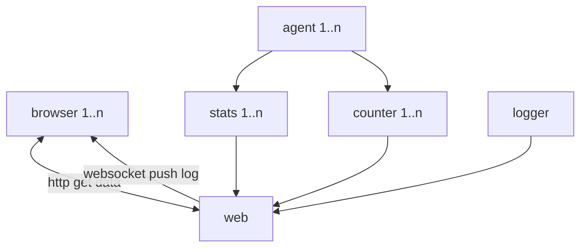

# snlocust
## Description
A high performence load test tool, implement with [skynet](https://github.com/cloudwu/skynet) and [locust](https://github.com/locustio/locust).

## Design


## Install
pull submodule
```
git submodule update --init
```
build linux
```
make linux
```
or macosx
```
make macosx
```

## run
```
./start.sh
```
open the browser with default url http://127.0.0.1:8001 